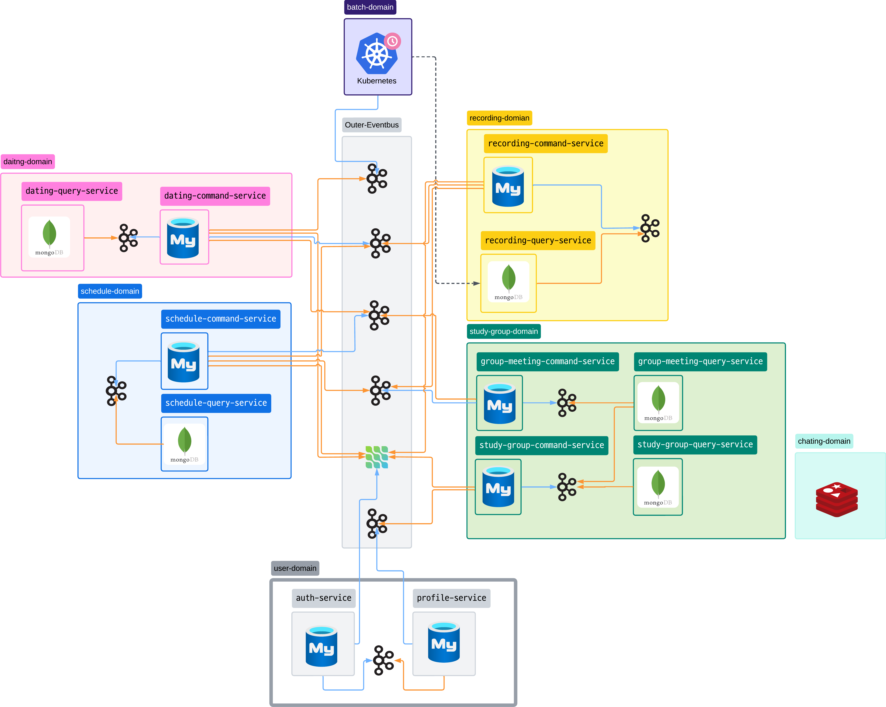

<!--

**Here are some ideas to get you started:**

🙋‍♀️ A short introduction - what is your organization all about?
🌈 Contribution guidelines - how can the community get involved?
👩‍💻 Useful resources - where can the community find your docs? Is there anything else the community should know?
🍿 Fun facts - what does your team eat for breakfast?
🧙 Remember, you can do mighty things with the power of [Markdown](https://docs.github.com/github/writing-on-github/getting-started-with-writing-and-formatting-on-github/basic-writing-and-formatting-syntax)
-->

# 🚀 **GREWMEET** connect 

## 1. Introduction

본 프로젝트는 복잡하고 다양한 사용자 상호작용을 안정적으로 처리할 수 있는 **차세대 소셜 플랫폼**을 제안합니다. 
MSA(마이크로서비스 아키텍처)를 기반으로, 최신 분산 시스템 설계 패턴인 **CQRS와 이벤트 기반 아키텍처(EDA)** 를 적용하여 시스템의 **확장성(Scalability), 회복탄력성(Resilience), 유지보수성(Maintainability)** 을 극대화하는 것을 목표로 합니다.

사용자는 스터디 그룹, 데이팅, 개인 일정 관리 등 여러 도메인의 서비스를 유기적으로 이용하며, 본 아키텍처는 이 과정에서 발생하는 대규모 트랜잭션을 안정적으로 처리할 수 있는 기술적 해결책을 제시합니다.

---

## 2. Core Technologies

| 구분 | 기술 스택 | 적용 사유 |
| :--- | :--- | :--- |
| **Backend** | Java, Spring Boot, Spring Cloud | 안정성과 방대한 커뮤니티를 통한 검증된 기술 생태계 활용 |
| **Database** | MySQL, MongoDB, Redis | CQRS 패턴에 맞춰 Command(Write)와 Query(Read)의 역할을 분리하고, 실시간 통신을 지원하기 위한 목적별 데이터베이스 채택 |
| **Message Broker** | Kafka | 대용량 이벤트를 실시간으로 처리하고, 서비스 간 비동기 통신을 통한 느슨한 결합(Loose Coupling)을 구현 |
| **Infrastructure** | Docker, Kubernetes | 서비스의 컨테이너화를 통해 개발 및 배포 환경을 표준화하고, CronJob을 이용한 주기적인 배치 작업을 안정적으로 실행 |

---

## 3. System Architecture

### 3.1. 전체 구조도

본 프로젝트의 전체 아키텍처는 각 서비스의 역할을 명확히 분리하고, 데이터 흐름의 일관성을 유지하는 데 중점을 두었습니다.

### 3.2. 핵심 설계 패턴

* **CQRS (Command Query Responsibility Segregation):** 데이터의 상태를 변경하는 **Command**와 데이터를 조회하는 **Query**의 책임을 명확히 분리했습니다. 이를 통해 쓰기 작업의 부하가 읽기 작업에 영향을 주지 않도록 격리하고, 각 작업에 최적화된 데이터 모델(MySQL for Write, MongoDB for Read)을 사용하여 성능을 극대화했습니다.

* **이벤트 기반 아키텍처 (Event-Driven Architecture):** 중앙의 **이벤트 버스(Kafka)** 를 통해 서비스 간의 상호작용을 비동기적으로 처리합니다. 서비스는 자신의 상태 변화를 '이벤트'로 발행할 뿐, 다른 서비스의 처리 방식에 의존하지 않으므로 높은 수준의 자율성과 유연성을 확보합니다.

* **CDC (Change Data Capture) with Debezium:** 🌟 **CQRS 패턴의 데이터 동기화를 위해 Debezium을 사용합니다.** Command 서비스가 Write DB(MySQL)에 데이터를 저장하고 동시에 이벤트 버스에 메시지를 발행하는 방식(듀얼 라이팅)은 데이터 정합성을 깨뜨릴 위험이 있습니다. Debezium은 애플리케이션을 대신하여 데이터베이스의 트랜잭션 로그(Binlog)를 직접 감시합니다. 데이터베이스에 **'커밋'된 변경 사항만을 신뢰성 있게 캡처**하여 이벤트로 발행하므로, Command 모델과 Query 모델 간의 **데이터 정합성을 강력하게 보장**하는 핵심적인 역할을 수행합니다.

### 3.3. 통신 규약
* **🔵 파란색 실선 (Publish):** 서비스가 발생시킨 이벤트를 이벤트 버스에 발행합니다.
* **🟠 주황색 실선 (Subscribe):** 서비스가 이벤트 버스로부터 필요한 이벤트를 구독합니다.
* **⚫ 점선 (API Call):** 다른 서비스의 기능이 즉시 필요한 경우, REST API 또는 gRPC를 이용한 동기(Synchronous) 호출을 수행합니다.

---

## 4. Domain-Driven Design

| 도메인 | 역할 및 책임 (Responsibilities) |
| :--- | :--- |
| **`user-domain`** | **인증 및 프로필 시스템:** JWT 기반 인증/인가 처리 및 사용자의 핵심 프로필 데이터를 관리하는 '신원 확인의 주체'입니다. |
| **`dating-domain`** | **데이팅 프로세스 관리:** 데이팅 이벤트의 생성, 참여 신청, 매칭 등 핵심 비즈니스 로직을 관장하는 '프로세스 오케스트레이터'입니다. |
| **`study-group-domain`** | **스터디 그룹 관리:** 스터디 그룹 및 그룹 내 미팅의 라이프사이클을 전담하며, 관련 비즈니스 규칙을 적용합니다. |
| **`schedule-domain`** | **개인 일정 관리:** 사용자가 참여하는 모든 외부 이벤트(데이팅, 스터디 등)를 자신의 캘린더에 기록, 조회, 관리하는 개인화 서비스입니다. |
| **`recording-domain`** | **중앙 활동 기록 시스템:** 시스템 전체에서 발생하는 모든 유의미한 이벤트를 구독하여, 감사(Audit) 및 데이터 분석의 기반이 되는 원본 데이터를 기록하는 '블랙박스'입니다. |
| **`batch-domain`** | **주기적 작업 실행:** 쿠버네티스 CronJob을 이용하여 정해진 시간에 특정 작업을 일괄적으로 실행합니다. (예: 분기별 사용자 활동을 집계하여 자격 부여) |
| **`chatting-domain`** | **실시간 통신:** Redis의 Pub/Sub 기능을 활용하여 사용자 간의 실시간 채팅 메시지를 중계합니다. |

---

## 5. Conclusion

본 프로젝트는 단순한 기능 구현을 넘어, 대규모 트래픽과 복잡한 비즈니스 요구사항에 대응할 수 있는 현대적인 아키텍처 설계를 목표로 하였습니다. MSA, CQRS, EDA 패턴의 유기적인 조합을 통해 시스템의 각 구성요소가 독립적으로 진화할 수 있는 기틀을 마련했으며, 이는 곧 **빠른 기능 개발, 안정적인 서비스 운영, 그리고 지속 가능한 확장**으로 이어질 것입니다.
